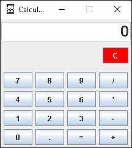

<h1>Calculator Application in Java [MVC] </h1>

In this project a calculator has been made with the MVC pattern in Java. This application can perform basic functions such as multiply, divide, subtract or add. It also takes into account your display digit limit and the use of numbers with decimal points.

<h2>Visual of Calculator</h2>

